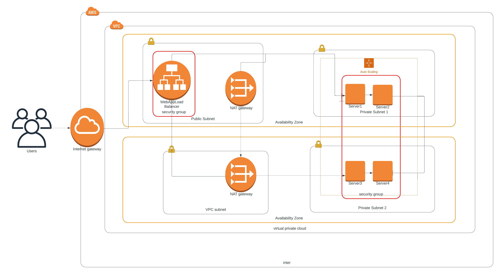

# Infrastructure Provisioning As Code Using Cloudformation

This project deploys an Apache web server for a highly available web application using [CloudFormation](https://docs.aws.amazon.com/AWSCloudFormation/latest/UserGuide/Welcome.html). AWS CloudFormation is a service that helps in provisioning AWS resources as many as it could be instead of creating them through the AWS console one after the other, cloudformation creates a template that describes all the AWS resources like Amazon EC2 instances and it takes care of provisioning and configuring those resources.

The infrastructure diagram was made using a diagrammimg application [Lucidchart](https://www.lucidchart.com/pages/), which displays all the resources needed to be deployed and provisioned by cloudformation.

## Brief Description Of files in the Repository

- **project.yml**

  This file contains the cloudformation template for all resources needed to be provisioned to deploy the apache web server up and running, the code is written in yaml.

  The resources provisioned as code includes; 
    - VPC
    - InternetGateway
    - Subnets
    - Route and Route tables
    - Security Groups
    - Launch Configuration
    - Load Balancers
    - AutoScaling Group

- **project-params.json**

  The `Parameters` section in `project.yml` is used to cystomize the templates, the `project-params.json` enables us to input custom values to the resources specified in the template each time the stack is created or updated.

### Prerequisites

The following tools should be installed and working.

- [awscli](https://aws.amazon.com/cli/)
- Create an account on [AWS](https://aws.amazon.com/)

### Deploying the Resources

To get the Apache webserver up and running, we will create a cloudformation stack.

Run the following command on the local machine configured with aws cli
 
 Creating Stack

 > `aws cloudformation create-stack --stack-name [nameofstack] --region [region of your choice] --template-body file://project.yml --parameters file://project-params.json`

 Updating Stack

  > `aws cloudformation update-stack --stack-name [nameofstack] --region [region of your choice] --template-body file://project.yml --parameters file://project-params.json`

 A successful deployment should output the **StackID** in a JSON format.

 #### Check that Apache Webserver is Up and Running.

Apache Webserver communicates using port 80 as created in the Security group of `project.yml`, to check that the server is running navigate to the AWS console check for **EC2** in the services, click on **Instances** and finally copy the Public DNS of the Instance.

Open the browser and type http://[PublicDNS] the image below shows a successful depolyment.

**Note** The project was built for an Instagram Clone called Udagram.